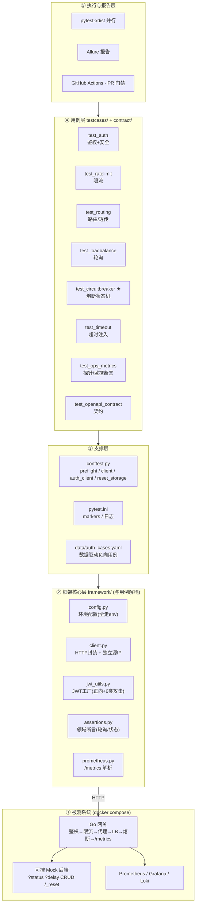
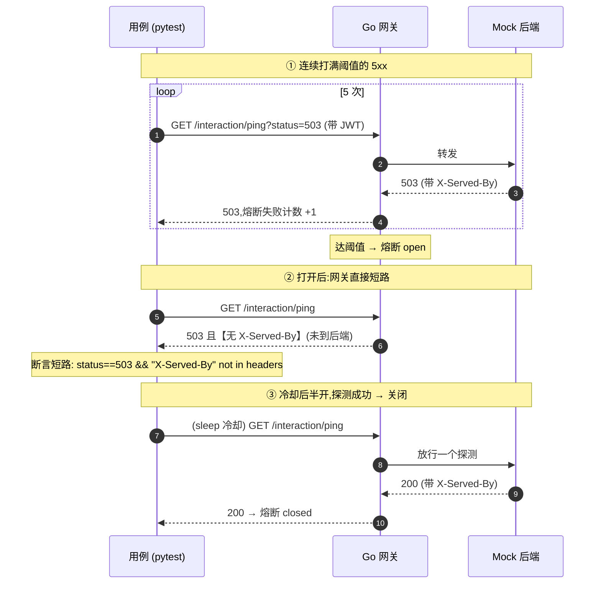
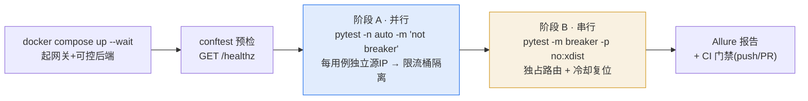

# 测试框架架构图(面试讲解版)

三张图,对应三个层面讲:**怎么分层**、**怎么做故障注入**、**怎么在 CI 里跑**。

---

## 图 1 · 分层架构

从下往上:被测系统 → 框架核心(可复用)→ 支撑(夹具/配置/数据)→ 用例 → 执行与报告。
**核心思想:用例只写"业务意图",样板(鉴权、源 IP、断言、指标解析)全部下沉到 framework。**

---

## 图 2 · 故障注入 & 熔断判定(最能讲深度)

难点:熔断/超时这类异常路径,**真实后端几乎无法稳定复现**。用**可控 Mock**
主动制造故障 → 100% 确定性、零 flaky。判定技巧:**网关短路 = 503 且无
`X-Served-By`**(请求没到后端),以此区分"熔断"与"后端错误"。

---

## 图 3 · CI 两阶段执行(体现 flaky 治理)

先分析**哪些状态按 IP 隔离、哪些是服务端共享**,据此决定并行/串行:

---

### 一分钟讲解脚本

> "框架分五层:最上是**用例**,只表达业务意图;往下是**支撑层**(夹具、数据驱动)
> 和**框架核心**(HTTP 封装、JWT 工厂、领域断言、指标解析),样板全部下沉,所以
> 加用例改动小、换环境只动 config。被测系统用 docker compose 一键起,包含一个
> **可控 Mock 后端**——这是关键,它让我能用 `?status`/`?delay` 主动注入故障,把
> 熔断、超时这些**真实后端难复现**的路径做到确定性、零 flaky。执行上我按状态是否
> 共享分了两阶段:大多数用例按 IP 隔离所以**并行**跑得快,熔断是服务端共享状态所以
> **串行**独占并冷却复位,最后出 Allure 报告并挂在 PR 上做门禁。"
